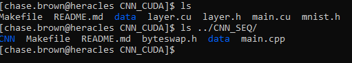

Parallel and Distributed Final Project

Chase Brown

Downloading and running the sequential and CUDA CNN programs on Heracles

Step 1.
Log into your heracles account on the cu Denver network. From the file directory you wish to download the project run

    $ git clone https://github.com/BroChase/cuda_CNN.git

    $ git clone https://github.com/BroChase/seq_CNN.git

This will create two directories /home/user/../cuda_CNN and /home/user/../seq_CNN in the directory you ran the git clone. The data files are large and unable to store them on github. These files can be downloaded and uploaded to Heracles. There will be 4 files in the data folder. These are the train and test files from the edited Faces in the Wild dataset.

Data files : [https://drive.google.com/drive/folders/1Yt0P7SjDS95Juyit9bhNYeOKVE5jbgJ4?usp=sharing](https://drive.google.com/drive/folders/1Yt0P7SjDS95Juyit9bhNYeOKVE5jbgJ4?usp=sharing)

The file structure on Heracles should look like below

In the cuda_CNN folder there is a Makefile. The paths need to be updated for your system! Edit to:

ssh node18 nvcc /home/user/../cuda_CNN/main.cu /home/user/../cuda_CNN/layer.cu -o /home/user/../cuda_CNN/CNN

In both the cuda_CNN and seq_CNN folders run make in the terminal.

    $ make

Run them $ ./CNN and $ ./CNN_TEST to test the programs.

You can find my sides from both of my presentations this semester below. Any questions or concerns please email.

[https://docs.google.com/presentation/d/1joEvtB5Vzv3oIYiQR_WYFzKS1BT7p27dEcsEapYdO_c/edit?usp=sharing](https://docs.google.com/presentation/d/1joEvtB5Vzv3oIYiQR_WYFzKS1BT7p27dEcsEapYdO_c/edit?usp=sharing)
